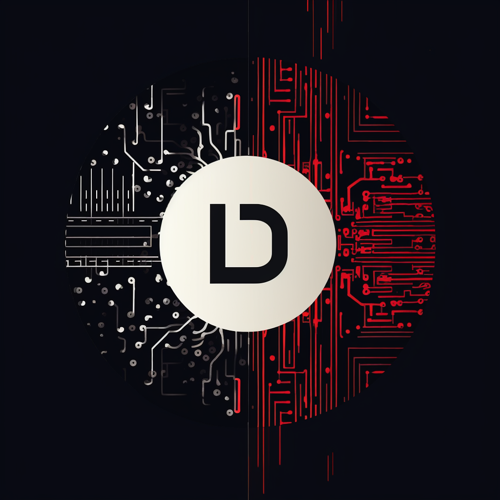

# CDLI 

<p align="center">
  
</p>

## Introduction

Welcome to the CDLI, a collaborative effort aimed at revolutionizing AGI. Our mission is to create an interactive and engaging platform for learners and contributors globally.


Check out our [GitHub Contribution Graph](https://github.com/users/ActualUsername/contributions)


## Collaborators

Meet our team of dedicated collaborators:

- **[Collaborator 1](https://github.com/themkdemiiir)** - Mehmet Kaan Demir
- **[Collaborator 2](https://github.com/Simurgan)** - Ömer Şükrü Uyduran
- **[Collaborator 3](https://github.com/rekurrenzk)** - Fatih Burak Karagöz

## Connect with Us

- **[Our Website](http://cdliproject.com/)**
- **[Twitter](https://twitter.com/cdliproject)**
- **[LinkedIn](https://www.linkedin.com/company/cdliproject)**


## CI/CD with GitHub Actions

We use GitHub Actions for continuous integration and deployment. Our workflows ensure code quality and efficient deployment.

### Node.js Continuous Integration Workflow

Our `Node.js CI` workflow is triggered on every push and pull request to the main branch. It performs the following tasks:

- **Checkout**: Checks out the source code.
- **Node Setup**: Sets up the Node.js environment.
- **Install Dependencies**: Runs `npm ci` to install dependencies.
- **Build**: Runs `npm run build`.
- **Test**: Executes `npm test`.

The workflow is defined in `.github/workflows/nodejs.yml`:

```yaml
name: Node.js CI
on: ...
jobs: ...
